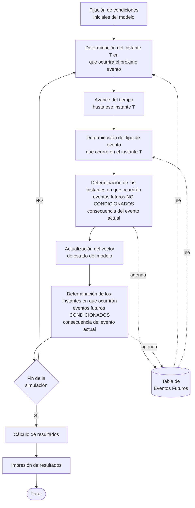

# Metodología de incrementos variables (evento a evento)

Transcripción del diagrama de flujo de la teoría de la cátedra (*Simulación — UTN FRBA*, "Metodologías
para incrementos del tiempo", inciso a). Define el orden en que el motor tiene que hacer las cosas
dentro de cada iteración; es la referencia estructural para el motor del TP.

## Diagrama

## Pasos

1. **Fijación de condiciones iniciales del modelo** — una sola vez, fuera del ciclo.
2. **Determinación del instante `T` del próximo evento** — mínimo de la TEF.
3. **Avance del tiempo hasta ese instante `T`**.
4. **Determinación del tipo de evento** que ocurre en `T` — cuál de las entradas de la TEF dio el mínimo.
5. **Agendado de los eventos futuros no condicionados** consecuencia del evento actual.
6. **Actualización del vector de estado del modelo**.
7. **Agendado de los eventos futuros condicionados** consecuencia del evento actual — recién acá, porque
   sus condiciones se evalúan sobre el estado ya actualizado en el paso 6.
8. **¿Fin de la simulación?** — si no, se vuelve al paso 2; si sí, se sigue con el cierre.
9. **Cálculo de resultados**.
10. **Impresión de resultados** y fin.

Notas sobre la transcripción:

- En el original, la Tabla de Eventos Futuros aparece como un bloque lateral unido con líneas
  punteadas a los pasos 2, 4, 5 y 6, sin distinguir gráficamente lectura de escritura. Acá se
  etiquetaron los enlaces según el sentido que tienen en el ciclo: los pasos 2 y 4 **leen** la TEF, y
  los pasos que determinan instantes de eventos futuros (5 y 7) la **actualizan**.
- El orden 5 → 6 → 7 es el punto fino del esquema: los eventos no condicionados se agendan con el
  estado previo, y los condicionados después de actualizar el estado, que es lo que hace que sus
  condiciones se evalúen contra los valores correctos.
